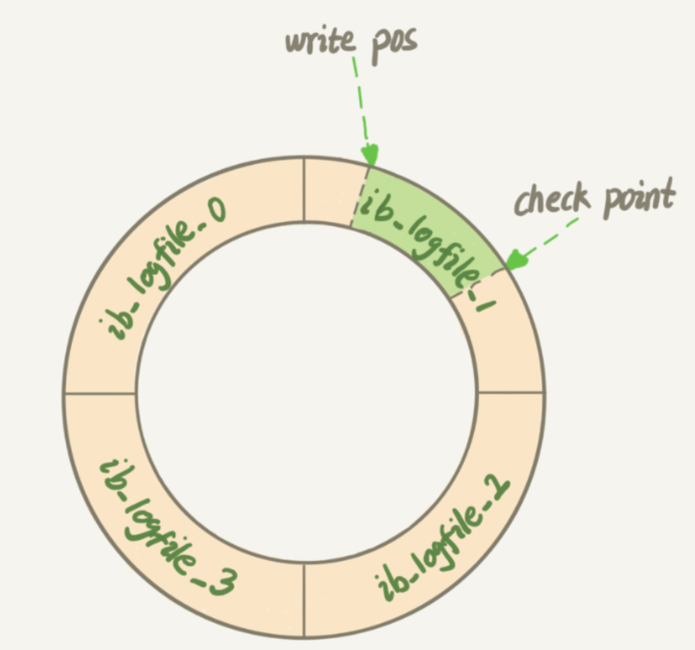

## 1. 什么是redo log?
    WAL的全称：Write-Ahead Logging，关键点先写日志，再写磁盘.
    InnoDB的redo log是固定大小的;比如可以配置为一组4个文件，每个文件大小是1GB，那么redolog就可以记录4GB的操作，从头开始写，写到尾部就又回到开头循环写.
    配置命令：
    innodb_log_file_size:指定redo日志大小，默认值48MB
    innodb_log_files_in_group:指定日志文件中redo日志文件数量.
    redo log具体格式如下:
    

